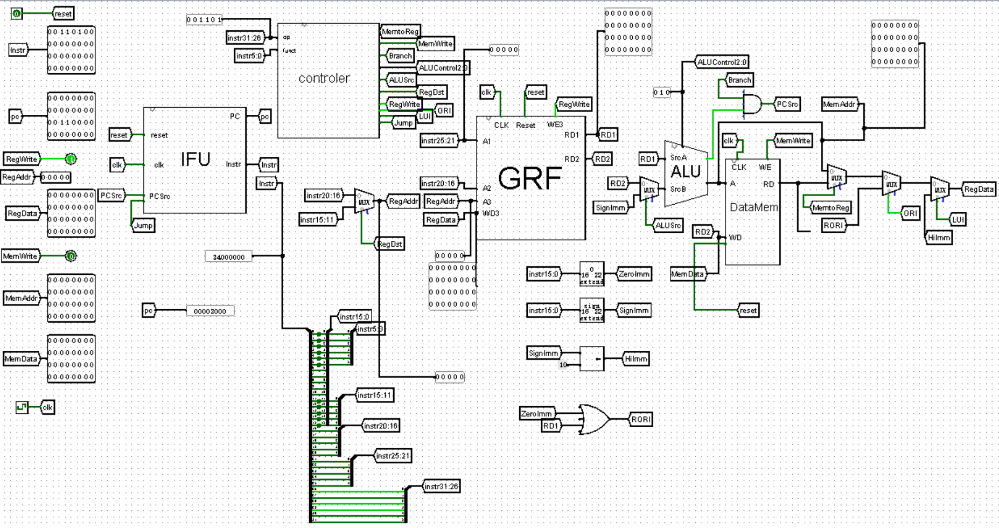

# CPU设计文档
## 设计草稿

### 顶层电路图（p3)



### 模块设计

* IFU
  * 输入：
    * reset，实现异步复位
    * clk，时钟信号
    * PCSrc,Jump,jr控制信号
    * jrAddr,jr跳转地址
  * 输出：
    * PC，指令地址
    * instr,指令
  * 功能：
    * 根据控制信号，计算出下一个指令，稳定地在每个周期给出当前指令

* GRF
  * 输入：
    * WPC,系统调用输出的时候需要
    * clk,时钟信号
    * reset,异步复位
    * WE,写入使能信号，为1时表示将WD内容写入A3指定的寄存器中
    * A1[4:0]，指定一个寄存器，内容输出到RD1
    * A2[4:0]，指定一个寄存器，内容输出到RD2
    * A3[4:0]，指定WD写入的寄存器
    * WD3[31:0]，A3指定的寄存器中写入的内容
  * 输出：
    * RD1[31:0],A1指定寄存器中的数据
    * RD2[31:0],A2指定寄存器中的数据
  
* ALU
  * 输入：
    * SrcA[32:0],操作数A
    * SrcB[32:0],操作数B
    * ALUControl[2:0]，控制信号，决定进行哪种运算
  * 输出：
    * Zero,为1时表示输出结果为0
    * ALUResult[31:0],运算结果

* DM
  * 输入：
    * pc，系统调用输出的时候需要
    * clk，时钟信号
    * WE，写入使能信号，为1时表示写入数据，为0时表示读出数据
    * A[4:0]，指定写入或读出的地址
    * WD[31:0]，写入内容
  * 输出：
    * RD：表示读出的数据

* Controler
  * 输入：
    * instr[31:26]\(op)
    * instr[5:0]\(funct)
  * 输出：控制信号（略）


### 设计时遇到的问题
*仿真时爆红：顶层模块有端口未连接
*beq指令的PCBranch计算错误
*DM和IM范围太小，看错题目要求

## 测试方案

使用python代码随机生成会汇编代码，MARS导出机器码到code.txt中，对比输出

比如想要生成

一个好的调试方式是，在控制器中加入一个按周期输出当前指令的功能，方便调试。

```
always #10 begin
	 if(add) $display("add");
	 if(sub) $display("sub");
	 if(AND) $display("AND");
	 if(OR) $display("OR");
	 if(slt) $display("slt");
	 if(lw) $display("lw");
	 if(sw) $display("sw");
	 if(beq) $display("beq");
	 if(addi) $display("addi");
	 if(ori) $display("ori");
	 if(lui) $display("lui");
	 if(j) $display("j");
	 if(nop) $display("nop");
	 if(jr)$display("jr");
	end
```

这样就可以很容易看出哪条指令出错了，或者有没有两条指令占用了同一个op和funct。

需要注意到是，跳转指令如果随机生成很容易让代码陷入循环，所以最好自己设计测试数据。可以采用随机生成加自己嵌入跳转指令的方式。

我的测试数据的一小部分：
```
add $2,$3,$13
ori $17,$17,28534
beq $17,$3,label50
lui $19,47485
add $16,$11,$5
lui $24,4920
sub $19,$5,$11
label55:
lw $11,7396($0)
lui $18,7914
sub $18,$7,$5
nop
add $10,$15,$16
lui $15,25663
ori $16,$5,13280
add $24,$17,$0
add $14,$3,$8
ori $9,$7,42070
label56:
ori $25,$2,7587
label57:
ori $21,$1,34427
lw $8,11932($0)
sw $17,7824($0)
lw $8,11436($0)
sub $1,$5,$20
nop
```

## 思考题汇总

1.addr信号一般来自于ALU的运算结果
如果使用32位寄存器模拟，真正在取数据的时候需要将地址除以四，所以这里直接取11：2位，相当于除以四，同时有效位数不变


2.译码方式：
 
 | 控制信号\指令  | add  | sub  | ori  | lw   | sw   | beq  | lui  | jal  | jr   | nop  |
|-------|------|------|------|------|------|------|------|------|------|------|
| ALUOp | 10   | 10   | 00   | -    | -    | -    | 00   | 10   | -    | -    |
| ALUSrcA | 0    | 0    | 0    | 0    | 0    | 0    | 1    | 0    | 0    | 0    |
| ALUSrcB | 1    | 1    | 1    | 1    | 0    | 1    | 0    | 0    | 0    | 0    |
| ImmSel | 0    | 0    | 1    | 0    | 1    | 0    | 1    | 0    | 0    | 0    |
| RegDst | 1    | 1    | 1    | 0    | 0    | 1    | 0    | 0    | 0    | 0    |
| RegWrite | 1    | 1    | 1    | 1    | 0    | 1    | 0    | 0    | 0    | 0    |
| MemRead | 0    | 0    | 0    | 1    | 0    | 0    | 0    | 0    | 0    | 0    |
| MemWrite | 0    | 0    | 0    | 0    | 1    | 0    | 0    | 0    | 0    | 0    |
| Branch | 0    | 0    | 0    | 0    | 0    | 1    | 0    | 0    | 0    | 0    |
| Jump | 0    | 0    | 0    | 0    | 0    | 0    | 0    | 1    | 0    | 0    |
| MemtoReg | 0    | 0    | 0    | 1    | 0    | 0    | 0    | 0    | 0    | 0    |


| 控制信号 | 取值 | 指令 |
|----------|------|------|
| ALUOp    | 1    | add, sub |
| ALUOp    | 0    | ori, lw, sw, beq, lui, jal, jr, nop |
| ALUSrcA  | 1    | lui |
| ALUSrcA  | 0    | add, sub, ori, lw, sw, beq, jal, jr, nop |
| ALUSrcB  | 1    | ori, lw, jal |
| ALUSrcB  | 0    | add, sub, lui, sw, beq, jr, nop |
| ImmSel   | 1    | ori, lw, sw, lui |
| ImmSel   | 0    | add, sub, beq, jal, jr, nop |
| RegDst   | 1    | add, sub, ori |
| RegDst   | 0    | lw, sw, beq, lui, jal, jr, nop |
| RegWrite | 1    | add, sub, ori, lw, jal |
| RegWrite | 0    | sw, beq, lui, jr, nop |
| MemRead  | 1    | lw |
| MemRead  | 0    | add, sub, ori, sw, beq, lui, jal, jr, nop |
| MemWrite | 1    | sw |
| MemWrite | 0    | add, sub, ori, lw, beq, lui, jal, jr, nop |
| Branch  | 1    | beq |
| Branch  | 0    | add, sub, ori, lw, sw, lui, jal, jr, nop |
| Jump    | 1    | jal, jr |
| Jump    | 0    | add, sub, ori, lw, sw, beq, lui, nop |
| MemtoReg | 1  | lw |
| MemtoReg | 0  | add, sub, ori, sw, beq, lui, jal, jr, nop |

第一种方式便于在检查单独指令逻辑的时候使用，但是如果按照此逻辑写代码会造成很多冗余，每加入一个指令就要多写一套逻辑
而第二种则是在编写代码逻辑的时候更简单，但是不便于检查单独指令

3.同步复位中，clk信号优先级高，异步复位中，reset信号优先级高

4.因为addi，add和addiu，addu的区别只在于是否检查溢出，
addu正是不考虑溢出情况的add指令，addiu正是不考虑溢出情况的addi指令，所以在忽略溢出的前提下，addi与addiu是等价的，add与addu是等价的
